# AIUsage

[](https://github.com/hyd1aa/aiusage/releases/latest)
[](https://github.com/hyd1aa/aiusage/actions/workflows/ci.yml)

[](LICENSE)

[简体中文](README.md) | **English**

A lightweight, responsive terminal dashboard for AI CLI usage and rate limits, especially suited to SSH, VPS, and tmux split-pane workflows.

View remaining percentages, usage windows, and reset times from clients such as Codex and Grok in one SSH, VPS, or Linux terminal dashboard.

[Introduction](#introduction) · [tmux 3-Pane Setup](#tmux-three-pane) · [Preview](#preview) · [Installation](#installation) · [After installation](#after-installation) · [Quick start](#quick-start) · [Support](#provider-support) · [Themes](#themes) · [Shortcuts](#keyboard-shortcuts) · [Configuration](#configuration)

## Introduction

AIUsage runs directly in the terminal without a web panel or background daemon. New users can run `ai` for the unified management menu; experienced users can run `aiusage` to open the responsive SSH, tmux, and VPS dashboard directly.

- Verified real usage readers for Codex and Grok
- Chinese by default for new users, with live English switching
- White and Green foreground themes
- One outer box, centered title, and natural content-driven size
- Responsive one-, two-, and three-column layouts
- Live system clock and 30-second usage refresh
- Unicode progress bars and low-flicker partial redraws
- No telemetry or usage/configuration uploads

<a id="tmux-three-pane"></a>

## 🖥️ Designed for a tmux 3-Pane Workflow

AIUsage was originally designed around a three-pane tmux workflow. A practical layout uses the large left Pane for your primary AI CLI, the upper-right Pane for a second AI CLI, shell, or logs, and the lower-right Pane for AIUsage. This keeps AI CLI limits, remaining percentages, reset times, and the system clock visible while you work.

Its compact single box, natural sizing, responsive layout, and low-flicker refresh make AIUsage a good fit for a small tmux Pane over SSH or on a VPS.

👉 [tmux 3-Pane Beginner Guide](https://github.com/hyd1aa/tmux-3-pane-guide)

<br>

[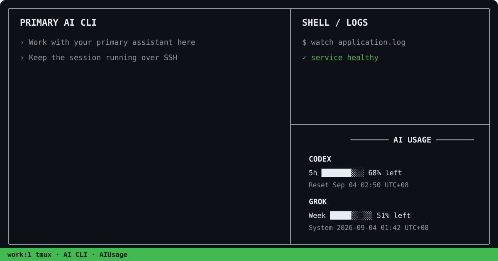](https://github.com/hyd1aa/tmux-3-pane-guide)

<br>

tmux is recommended for this workflow, but it is not a requirement. AIUsage also works as a standalone terminal application in a regular SSH, VPS, or Linux terminal.

## Preview

### Real mode

<br>

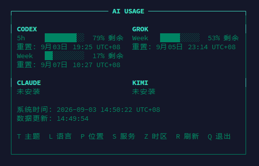

<br>

`aiusage` displays real usage only when a reliable local source exists. This is an English UI example; percentages and times come from your own installed clients:

```text
┌────────────────── AI USAGE ──────────────────┐
│                                              │
│   CODEX                                      │
│   5h     ███████░░░  37% left                │
│   Reset: Sep 03 02:50 UTC+08                 │
│   Week   ███████░░░  35% left                │
│   Reset: Sep 07 10:27 UTC+08                 │
│                                              │
│   GROK                                       │
│   Week   █████████░  53% left                │
│   Reset: Sep 05 23:14 UTC+08                 │
│                                              │
│ System: 2026-09-02 23:43:32 UTC+08           │
│ Usage updated: 23:43:15                      │
│                                              │
│ T Th L Lang P Pos S Prov Z TZ R Ref Q Exit  │
│                                              │
└──────────────────────────────────────────────┘
```

There is one outer box; providers do not get individual boxes. The box takes its natural height from the content and is then placed at the selected position instead of filling the terminal.

### Demo mode

<br>

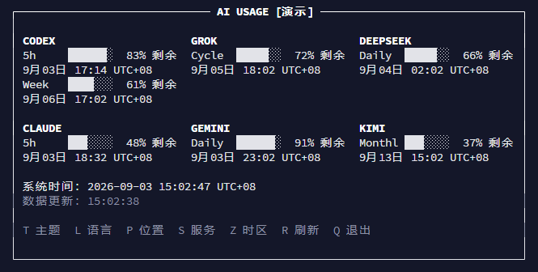

<br>

`aiusage --demo` uses deterministic fixtures for UI previews, README captures, responsive layout tests, and i18n checks. The dashboard is prominently marked **`[DEMO]`**.

The default demo shows Codex, Grok, MiniMax, Qoder, CodeBuddy, and TraeCode. Except for Codex and Grok, these are UI fixtures only; their percentages are not account data. See the full 80×24 text capture at [`docs/screenshots/demo-80x24.txt`](docs/screenshots/demo-80x24.txt).

## Installation

```bash
git clone https://github.com/hyd1aa/aiusage.git
cd aiusage
sudo ./install.sh
ai
```

The idempotent installer always installs `aiusage` and the AIUsage package. It also installs `ai` as a convenient management shortcut when that command is free. If another program already owns `ai`, installation still succeeds and the existing command is never overwritten. User configuration is preserved.

The installer only manages AIUsage-owned files and does not change permissions on existing shared directories such as `/usr/local/bin` or `/usr/local/lib`.

## After installation

The recommended entry point for new users is:

```bash
ai
```

This opens the unified management menu. If another program already owns `ai`, the installer leaves it untouched; use the guaranteed management entry instead:

```bash
aiusage --menu
```

It opens the same management menu, with dashboard launch, demo, settings, update checks, diagnostics, and confirmed uninstall:

```text
+--------------------------------------+
|               AIUsage                |
|    AI CLI usage terminal dashboard   |
+--------------------------------------+
Current version: v0.1.x
Latest version: v0.1.x
GitHub: https://github.com/hyd1aa/aiusage
----------------------------------------
1. Launch dashboard
2. Demo mode
3. Settings
4. Check / Update
5. Diagnostics
6. Uninstall AIUsage
0. Exit
```

Experienced users can continue to run:

```bash
aiusage
```

`aiusage` remains unchanged and opens the real dashboard directly. The manager and dashboard share one language, theme, position, timezone, and Provider configuration. A dashboard launched from `ai` returns to the menu when it exits.

Latest-version checks use a short timeout and local cache, so offline use remains responsive. Updates accept stable releases only from `https://github.com/hyd1aa/aiusage`, require explicit confirmation, verify the installed version, and invoke `sudo` only when `/usr/local` needs it. Updates preserve user configuration.

## Quick start

<br>

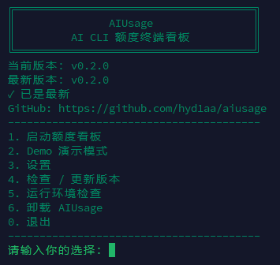

<br>

Management menu:

```bash
ai
```

Guaranteed management entry that does not depend on the short alias:

```bash
aiusage --menu
```

Real mode:

```bash
aiusage
```

Demo mode:

```bash
aiusage --demo
```

Other commands:

```bash
aiusage --version
aiusage --help
aiusage --demo --snapshot --size 80x24
```

## Provider support

| Provider | VPS CLI | Discovery | Real usage | Status |
| --- | --- | --- | --- | --- |
| Codex | ✅ | ✅ | ✅ | VERIFIED |
| Grok | ✅ | ✅ | ✅ | VERIFIED |
| MiniMax (`mmx`) | ✅ | ✅ | ⏳ | Auto-detectable; real quota pending verification (`DISCOVERY_ONLY`) |
| Qoder (`qoder`) | ✅ | ✅ | ⏳ | Auto-detectable; real quota pending verification (`DISCOVERY_ONLY`) |
| Qoder CN (`qodercn`) | ✅ | ✅ | ⏳ | Auto-detectable; real quota pending verification (`DISCOVERY_ONLY`) |
| CodeBuddy (`codebuddy` / `cbc`) | ✅ | ✅ | ❌ | Auto-detectable; no reliable quota interface (`DISCOVERY_ONLY`) |
| TraeCode (`traecli`) | ✅ | ✅ | ❌ | Auto-detectable; no reliable quota interface (`DISCOVERY_ONLY`) |

“Auto-detectable” means AIUsage can detect the CLI; it does not mean real quota reading is supported. Only Providers validated in a real environment receive the supported-real-usage mark. The `⏳` symbol explicitly means validation is pending. Real mode never substitutes demo values, and an enabled Provider without a verified reader is reported honestly as `Not installed`, `Unavailable`, or `Not supported`.

**ZCode:** ZCode is currently excluded from the primary VPS Provider list because an official headless terminal CLI has not been verified. It can be reconsidered if a suitable CLI becomes available later.

## Themes

<br>


<br>

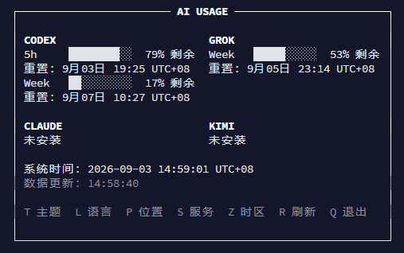

<br>

New users start with the **White** theme. Press `T` while AIUsage is running to switch:

```text
White ↔ Green
```

Themes affect foreground elements only:

- Text
- Outer border
- Progress bars

AIUsage always preserves the user's native terminal background. It never sets white, green, gray, or RGB backgrounds and never fills the dashboard with background-colored spaces.

## Language switching

<br>


<br>

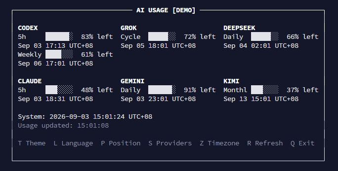

<br>

The default language for new users without a configuration file is Chinese. Press `L` to switch to English and save that preference.

An existing `language = "en"` setting remains English after upgrades. Provider brand names are never translated.

## Keyboard shortcuts

| Key | Action |
| --- | --- |
| `T` | White / Green theme |
| `L` | Chinese / English |
| `P` | Change dashboard position |
| `S` | Manage providers |
| `Z` | Select display timezone |
| `R` | Refresh immediately |
| `Q` | Exit |
| `Esc` | Exit |
| `Ctrl+C` | Exit |

In provider management, use arrow keys or `J` / `K` to select, `Space` to toggle, `U` / `D` to reorder, `Enter` to save, and `Esc` to cancel.

## Responsive layout

- 1–2 providers: compact single column
- 3 providers: 3×1 when space allows, otherwise fewer columns
- 4 providers: centered 2×2
- 5–6 providers: centered 3×2
- Narrower terminals: automatically reduce to two or one column

Every layout uses one outer box. The title is centered against the actual box width, while the compact provider grid is centered as one content block. Natural sizing means the box never expands merely to fill the terminal. The 80×24 layout is verified, and smaller terminals respond automatically.

## Provider management

<br>

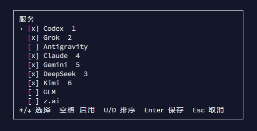

<br>

Press `S` to enable, disable, or reorder providers. Real mode defaults to Codex and Grok; demo mode defaults to six providers. Real and demo selections are saved separately, so demo configuration never becomes real usage.

## Automatic Provider discovery

The default is `auto_discover = true`. AIUsage performs one lightweight discovery pass at startup and scans again about every 300 seconds. Pressing `R` runs discovery immediately and then refreshes real usage for enabled providers. The regular 30-second usage refresh stays separate and does not rescan the complete registry.

Discovery checks installation, availability of a real reader, local authentication/session readiness, and availability of a reliable usage source. A new Provider is appended to the existing order only when its real reader is implemented and ready. “Installed” does not mean “supported”; unsupported and needs-login states never produce demo or fabricated usage.

When a user explicitly disables a Provider through `S` or the manager, AIUsage records `disabled_by_user` and discovery will not force it back on. Manually enabling it clears that marker. If a CLI is removed or its session expires, the configured position is retained for later recovery.

Settings in `ai` / `aiusage --menu` can toggle automatic discovery. Demo mode is fully isolated and never runs real discovery. MiniMax, Qoder, Qoder CN, CodeBuddy, and TraeCode currently detect executable installation only. Until a real reader passes production validation, an installed CLI reports `Usage unsupported` and never produces quota data.

## Dashboard position

<br>

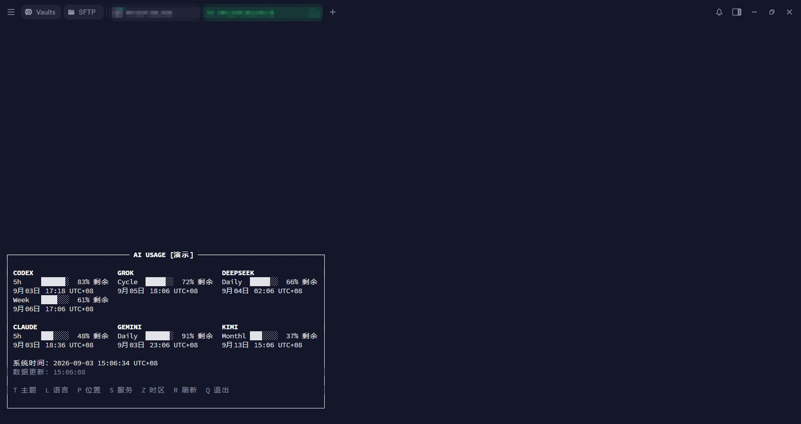

<br>

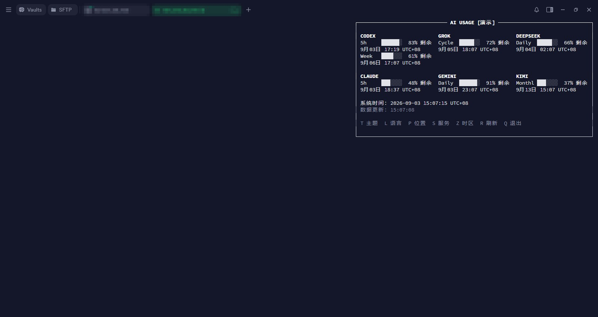

<br>

Press `P` to cycle and save:

```text
top-left / top-center / top-right / center /
bottom-left / bottom-center / bottom-right
```

Positioning moves the complete natural-size box without stretching its internal content.

## Time and timezones

<br>

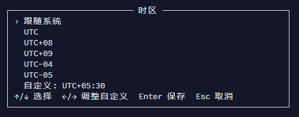

<br>

The default is `timezone = "system"`. AIUsage reads the operating system's current timezone whenever it starts and renders; it never caches an old system timezone in configuration. Restarting after the VPS timezone changes automatically follows the new setting.

Press `Z` to choose System, a common UTC offset, or a custom offset adjustable in 15-minute steps. Valid custom values span `UTC-12` through `UTC+14`, including `UTC+05:30`, `UTC+05:45`, and `UTC+09:30`. One display timezone applies to both System time and every Reset time.

The UI always uses unambiguous numeric labels such as `UTC+08` and `UTC-04`. It never displays `CST`, `EST`, `EDT`, `Asia/Shanghai`, or `America/New_York`. System IANA timezone rules are still used internally, so daylight-saving offsets are calculated for the actual timestamp.

AIUsage converts the absolute reset epoch; it does not merely replace a suffix. Given this original instant:

```text
2026-09-03 18:50 UTC
```

With `timezone = "UTC"`:

```text
Sep 03 18:50 UTC
```

With `timezone = "UTC+08"`:

```text
Sep 04 02:50 UTC+08
```

The date genuinely crosses from September 3 to September 4. Chinese renders the latter as `9月04日 02:50 UTC+08`.

If a VPS uses UTC but the user wants China Standard Time, set `timezone = "UTC+08"`. If the VPS itself already uses UTC+08, leave `timezone = "system"`.

## Configuration

Preferences are stored at:

```text
~/.config/aiusage/config.toml
```

Example:

```toml
language = "zh"
theme = "white"
position = "center"
timezone = "system"
auto_discover = true
real_providers = ["codex", "grok"]
demo_providers = ["codex", "grok", "minimax", "qoder", "codebuddy", "traecode"]
disabled_providers = []
```

The file stores only language, theme, position, display timezone, the discovery switch, enabled ordering, and explicitly disabled Providers—never tokens, cookies, accounts, IP addresses, hostnames, or usage snapshots. Older files without `timezone` or `auto_discover` automatically use `system` and `true`; no migration is required. Writes are atomic with user-only permissions. Missing, unreadable, or damaged configuration safely falls back. See [`config.example.toml`](config.example.toml).

## Privacy and security

- No usage, token, or configuration uploads
- No account provisioning or automated login
- No reading or sharing saved credentials
- No background daemon
- No telemetry
- Demo mode never invokes real adapters, authentication data, or remote usage APIs

AIUsage is an unofficial community utility. The Codex reader uses the CLI's local app-server rate-limit method. The Grok reader reads a bounded tail of its local structured billing log. Upstream interfaces may change and require updates. AIUsage does not bypass login, share tokens, or imitate client identities. See [`SECURITY.md`](SECURITY.md) for reporting guidance.

## System requirements

- Linux (tested)
- Python 3.10 or newer
- ANSI-capable terminal; UTF-8 recommended
- Corresponding CLI installed and legitimately authenticated by the user for real Codex/Grok usage

macOS is untested and may work. Windows is not currently supported. Set `NO_COLOR` to disable colored foreground styles while retaining structural Unicode borders and progress bars.

## Uninstall

<br>

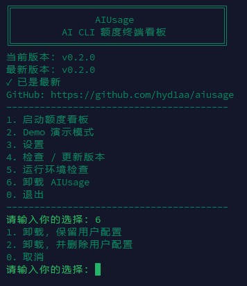

<br>

The recommended path is option 6 in `ai`, where you explicitly choose whether to preserve or remove user configuration and confirm the action a second time.

```bash
sudo ./uninstall.sh
```

Uninstall removes AIUsage program files but preserves `~/.config/aiusage/`. Remove that directory explicitly only if you also want to delete preferences.

## Development and contributing

```bash
python3 -m venv .venv
. .venv/bin/activate
python -m pip install -e '.[dev]'
python -m compileall -q src tests tools
python -m unittest discover -s tests -v
python tools/check_sensitive.py
```

Tests are fully offline and require no Codex or Grok login. New real provider adapters require reliable, verifiable sources; fabricated real usage and committed credentials are prohibited. See [`CONTRIBUTING.md`](CONTRIBUTING.md) and [`CHANGELOG.md`](CHANGELOG.md).

## License

Released under the [MIT License](LICENSE). Copyright uses the neutral “AIUsage contributors” holder and does not imply an individual's identity.
